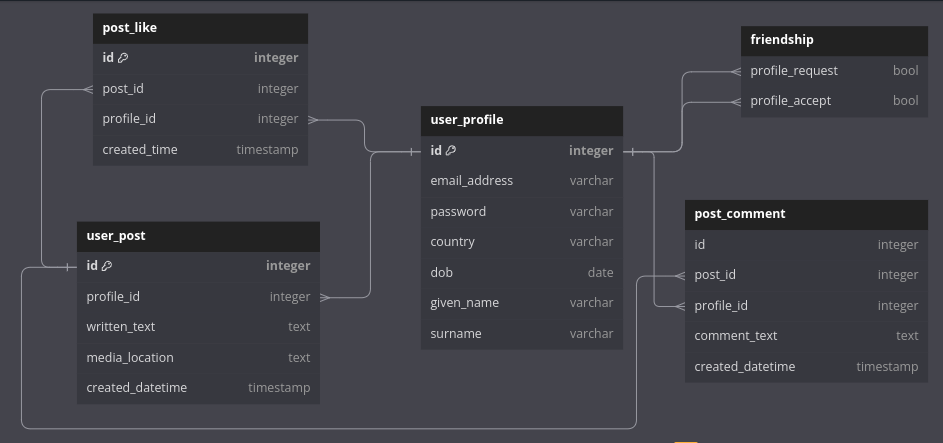

# Requirments
- Sign up and create a profile
- Add other profiles as friends 
- Add posts that contain text, photos, or videos
- See posts that our friends have added 
- Like and add comments to posts that others have added

# DBML CODE
```
Table user_profile{
  id integer [primary key]
  email_address varchar
  password varchar
  country varchar
  dob date
  given_name varchar
  surname varchar 
}

Table friendship{
  profile_request bool 
  profile_accept bool
}

Table user_post{
  id integer [primary key]
  profile_id integer
  written_text text
  media_location text
  created_datetime timestamp
}

Table post_like{
  id integer [primary key]
  post_id integer
  profile_id integer
  created_time timestamp
}

Table post_comment{
  id integer
  post_id integer
  profile_id integer
  comment_text text
  created_datetime timestamp
}

Ref: user_profile.id < friendship.profile_request
Ref: user_profile.id < friendship.profile_accept
Ref: user_profile.id < user_post.profile_id
Ref: user_profile.id < post_like.profile_id
Ref: user_post.id < post_like.post_id
Ref: user_profile.id < post_comment.profile_id
Ref: user_post.id < post_comment.post_id
```
# DB Design
