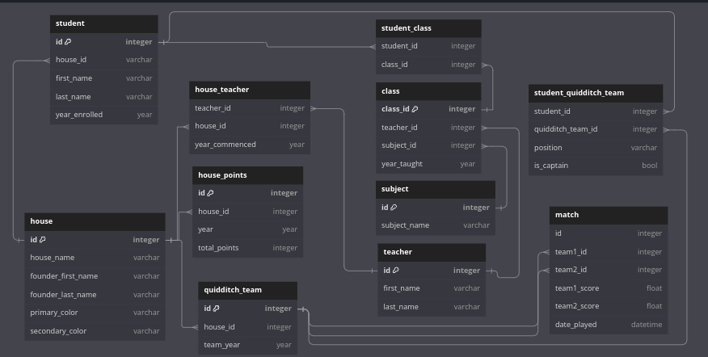

# DBML Code
```
Table student{
  id integer [primary key]
  house_id varchar
  first_name varchar
  last_name varchar
  year_enrolled year
}

Table student_class{
  student_id integer
  class_id integer
}

Table class{
  class_id integer [primary key]
  teacher_id integer 
  subject_id integer
  year_taught year
}

Table teacher{
  id integer [primary key]
  first_name varchar
  last_name varchar
}

Table subject{
  id integer [primary key]
  subject_name varchar
}

Table house_teacher{
  teacher_id integer
  house_id integer
  year_commenced year
}

Table house{
  id integer [primary key]
  house_name varchar
  founder_first_name varchar
  founder_last_name varchar
  primary_color varchar
  secondary_color varchar
}

Table house_points{
  id integer [primary key]
  house_id integer
  year year
  total_points integer
}

Table quidditch_team{
  id integer [primary key]
  house_id integer
  team_year year
}

Table student_quidditch_team{
  student_id integer
  quidditch_team_id integer
  position varchar
  is_captain bool
}

Table match{
  id integer
  team1_id integer
  team2_id integer
  team1_score float
  team2_score float
  date_played datetime
}
Ref: quidditch_team.id < match.team1_id
Ref: quidditch_team.id < match.team2_id
Ref: quidditch_team.id < student_quidditch_team.quidditch_team_id
Ref: class.class_id < student_class.class_id
Ref: subject.id < class.subject_id
Ref: teacher.id < class.teacher_id
Ref: teacher.id < house_teacher.teacher_id
Ref: student.id < student_class.student_id
Ref: student.id < student_quidditch_team.student_id 
Ref: house.id < house_teacher.house_id
Ref: house.id < student.house_id
Ref: house.id < house_points.house_id
Ref: house.id < quidditch_team.house_id
```
