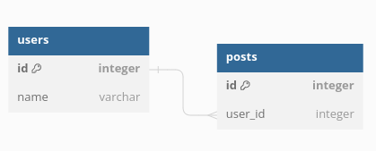
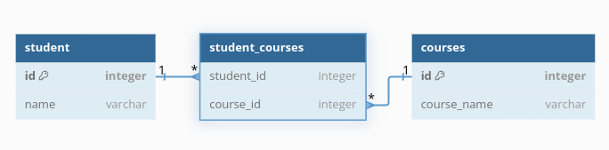
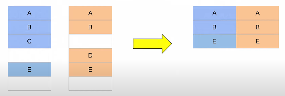
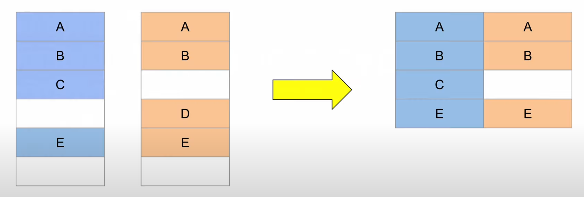
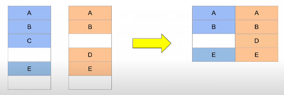
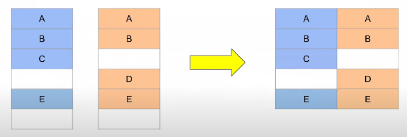
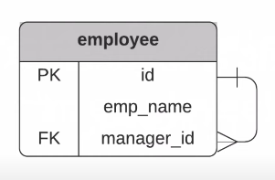

- https://dbdiagram.io/ (for db diagram)
- https://dbml.dbdiagram.io/docs/ (syntax of dbml)

## One to many relationship
- A one-to-many relationship in a database is when a record in one table can be associated with multiple records in another table. 
- Eg: one user can have many posts
- 

##  Many to Many relationship
- A many -to-many relationship in a database is when multiple record in one table can be associated with multiple records in another table
- Eg: many students can enroll in many classes
- 
- to create many to many relationship between two tables we need to add one table between.

## JOIN
- SQL joins are used to combine data from two or more tables in a database based on a related column between them. 
- Types of JOIN
    - INNER JOIN = JOIN : Inner Join joins two table on the basis of the column which is explicitly specified in the ON or USING clause.
    
    - LEFT JOIN : The LEFT JOIN returns all records from the left table, and the matching records from the right table.
    
    - RIGHT JOIN : The RIGHT JOIN  returns all records from the right table (table2), and the matching records from the left table (table1).
    
    - FULL OUTER JOIN : The FULL OUTER JOIN keyword returns all records when there is a match in left (table1) or right (table2) table records.
    
    - NATURAL JOIN : Natural Join in SQL joins two tables based on the same attribute name and datatypes. TWithout explicitly specified in the ON or USING clause
    - SELF JOIN : A self join is a regular join, but the table is joined with itself.
    

## How to join 3 tables 
1. select from first table
    ```
    SELECT book_id, title
    FROM book
    ```
2. join the 2nd table
    ```
    SELECT book_id, title
    FROM book
    INNER JOIN publisher
    ```
3. add join columns
    ```
    SELECT book_id, title
    FROM book
    INNER JOIN publisher
    ON book.publisher_id = publisher.publisher_id
    ```
4. add columns to select
    ```
    SELECT book_id, title, publisher_name
    FROM book
    INNER JOIN publisher
    ON book.publisher_id = publisher.publisher_id
    ```
5. join to third table
    ```
    SELECT book_id, title, publisher_name
    FROM book
    INNER JOIN publisher
    ON book.publisher_id = publisher.publisher_id
    INNER JOIN book_language
    ```
6. specify join columns
    ```
    SELECT book_id, title, publisher_name
    FROM book
    INNER JOIN publisher
    ON book.publisher_id = publisher.publisher_id
    INNER JOIN book_language
    ON book.language_id = book_language.language.id
    ```
7. add columns to select
    ```
    SELECT book_id, title, publisher_name, language
    FROM book
    INNER JOIN publisher
    ON book.publisher_id = publisher.publisher_id
    INNER JOIN book_language
    ON book.language_id = book_language.language.id
    ```