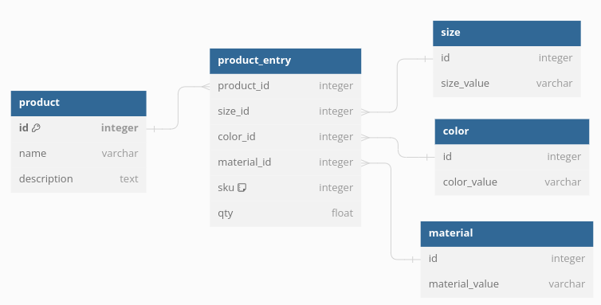

https://dbdiagram.io/d
```
Table product{
  id integer [primary key]
  name varchar
  description text
}

Table product_entry{
  product_id integer
  size_id integer
  color_id integer
  material_id integer
  sku integer [note: 'Stock keeping unit']
  qty float
}

Table size{
  id integer
  size_value varchar
}

Table color{
  id integer
  color_value varchar
}

Table material{
  id integer
  material_value varchar
}

Ref: product.id < product_entry.product_id

Ref: product_entry.size_id > size.id

Ref: product_entry.color_id > color.id

Ref: product_entry.material_id > material.id
```
